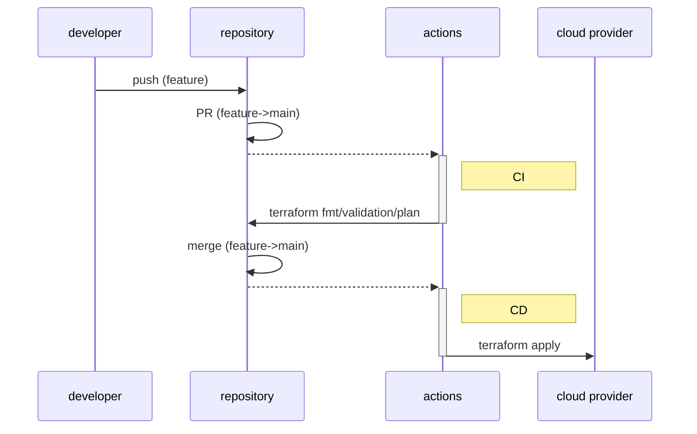

# someservice-manifests

## Terraform

```
$ cd terraform/environments/$ENV
$ terraform init
$ terraform show
$ terraform plan
```

### ディレクトリ構成

**環境分離パターン**で初めて、徐々に**環境ごと分離 + module利用パターン**へ移行する。  
- [Terraformのディレクトリ構成の模索 - Adwaysエンジニアブログ](https://blog.engineer.adways.net/entry/2020/07/03/150000)

### 環境変数

1Passwordで下記ファイルをDLしそれぞれの環境下に置く  

- Terraform tfvars(someservice-manifests Staging)
- Terraform tfvars(someservice-manifests Production)

ex) ./terraform/environments/staging/terrafrom.tfvars.json


### CI/CD
1. PR中のブランチへのコミットを検知し、CI(fmt/validation/plan)を実行
2. mainブランチへのコミットを検知し、CD(apply)を実行



CI/CDでは`tfaction`を利用
[公式ドキュメント](https://suzuki-shunsuke.github.io/tfaction/docs/)
